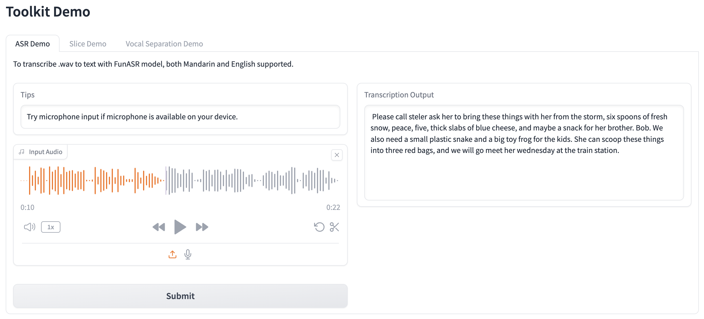
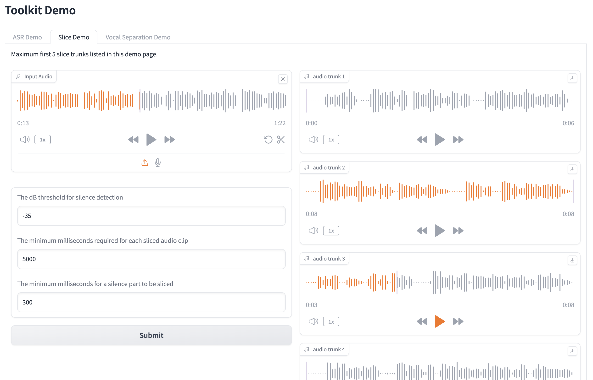
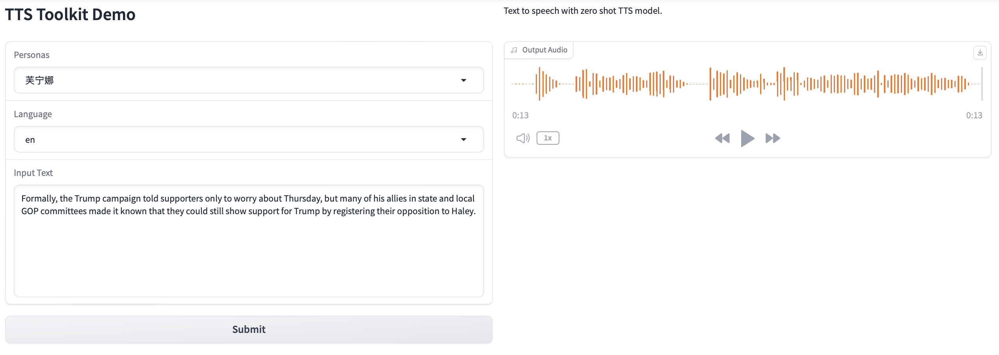

<!-- Improved compatibility of back to top link: See: https://github.com/othneildrew/Best-README-Template/pull/73 -->
<a name="readme-top"></a>
<!--
*** Thanks for checking out the Best-README-Template. If you have a suggestion
*** that would make this better, please fork the repo and create a pull request
*** or simply open an issue with the tag "enhancement".
*** Don't forget to give the project a star!
*** Thanks again! Now go create something AMAZING! :D
-->


<!-- PROJECT SHIELDS -->
<!--
*** I'm using markdown "reference style" links for readability.
*** Reference links are enclosed in brackets [ ] instead of parentheses ( ).
*** See the bottom of this document for the declaration of the reference variables
*** for contributors-url, forks-url, etc. This is an optional, concise syntax you may use.
*** https://www.markdownguide.org/basic-syntax/#reference-style-links
-->
[![Contributors][contributors-shield]][contributors-url]
[![Forks][forks-shield]][forks-url]
[![Stargazers][stars-shield]][stars-url]
[![Issues][issues-shield]][issues-url]
[![MIT License][license-shield]][license-url]


<!-- PROJECT LOGO -->
<br />
<div align="center">
  <a href="https://github.com/Jeru2023/">
    
  </a>

<h3 align="center">AI Twins</h3>
<p align="center">
Perfect AI Replication
<!--
    <br />
    <a href="https://github.com/Jeru2023/ai_twins"><strong>Explore the docs »</strong></a>
    <br />
    <br />
    <a href="https://github.com/Jeru2023/ai_twins">View Demo</a>
    ·
    <a href="https://github.com/Jeru2023/ai_twins/issues">Report Bug</a>
    ·
    <a href="https://github.com/Jeru2023/ai_twins/issues">Request Feature</a>-->
  </p>
</div>


<!-- TABLE OF CONTENTS -->
<details>
  <summary>Table of Contents</summary>
  <ol>
    <li>
      <a href="#about-the-project">About The Project</a>
      <ul>
        <li><a href="#built-with">Built With</a></li>
      </ul>
    </li>
    <li>
      <a href="#getting-started">Getting Started</a>
      <ul>
        <li><a href="#prerequisites">Prerequisites</a></li>
        <li><a href="#installation">Installation</a></li>
      </ul>
    </li>
    <li><a href="#usage">Usage</a></li>
    <li><a href="#roadmap">Roadmap</a></li>
    <li><a href="#contributing">Contributing</a></li>
    <li><a href="#license">License</a></li>
    <li><a href="#contact">Contact</a></li>
    <li><a href="#acknowledgments">Acknowledgments</a></li>
  </ol>
</details>


<!-- ABOUT THE PROJECT -->
## About The Project

<!--[![ai_twins Screen Shot][product-screenshot]](https://example.com)-->

This project aims to achieve two goals:

Modularization of functionalities from state-of-the-art projects in Automatic Speech Recognition (ASR), Text-to-Speech (TTS), and Wav2Lip, allowing independent usage of each module.

The project focuses on extracting the functionalities of leading projects in the field of ASR, TTS, and Wav2Lip and making them available as individual modules. By doing so, developers can easily integrate these modules into their applications as standalone components, without the need for extensive modifications or dependencies on the entire project.

Integration of multiple projects into a comprehensive end-to-end solution.

This project aims to combine the functionalities of various projects into a unified and seamless solution. By integrating ASR, TTS, and Wav2Lip capabilities, it provides a comprehensive pipeline that covers the entire process of converting text to synthesized speech with lip movement synchronization. This end-to-end solution simplifies the overall workflow and allows users to achieve high-quality results without the hassle of manually coordinating multiple projects.

By offering both independent modules and an integrated solution, this project provides flexibility and convenience for developers and researchers working in the field of digital humans. It enables them to leverage the best features from various projects and seamlessly integrate them into their own applications or research work.

<!--Here's a blank template to get started: To avoid retyping too much info. Do a search and replace with your text editor for the following: `Jeru2023`, `ai_twins`, `twitter_handle`, `linkedin_username`, `email_client`, `email`, `project_title`, `project_description`-->

<p align="right">(<a href="#readme-top">back to top</a>)</p>


<!-- GETTING STARTED -->
## Getting Started

This project uses [GPT-SoVITS](https://github.com/RVC-Boss/GPT-SoVITS) as submodule for voice clone, please follow the installation guideline from GPT-SoVITS to setup environment.

Please mind I've rename GPT-SoVITS by removing dash, as it's invalid character as pacakge name.
```sh  
git submodule add git@github.com:RVC-Boss/GPT-SoVITS.git GPTSoVITS
```
### Prerequisites
1. Install ffmpeg

2. Pretrain Models
   
Download pretrained models from [GPT-SoVITS Models](https://huggingface.co/lj1995/GPT-SoVITS/tree/main) and place them in GPTSoVITS/GPT_SoVITS/pretrained_models

### Installation

1. Create independent Python Environment.
   ```sh    
    conda create -n ai_twins python=3.9
    conda activate ai_twins
   ```
2. Clone the repo
   ```sh
   git clone https://github.com/Jeru2023/ai_twins.git
   ```
3. Install packages
   ```sh
   install -r requirements.txt
   install -r GPTSoVITS/requirements.txt
   ```
4. Overwrite config.py under GPTSoVITS
   ```sh
   cd ai_twins
   mv config-GPTSoVITS.py GPTSoVITS/config.py
   ```
5. To run test or WebUI Demo, create three empty folders in output:
   slice_trunks, tts, upload

<p align="right">(<a href="#readme-top">back to top</a>)</p>


<!-- USAGE EXAMPLES -->
## Usage

### Function call
Please refer to the test files in test folder.
#### TTS
```python
from infer.tts_model import TTSModel
import utils
from infer.persona_enum import PersonaEnum
import os


tts_model = TTSModel()
root_path = utils.get_root_path()

persona_name = PersonaEnum.NORMAL_FEMALE.get_name()
text = '今天天气不错呀，我真的太开心了。'
uuid = utils.generate_unique_id(text)

# en for english
text_language = 'zh'
output_path = os.path.join(root_path, 'output', 'tts', f'{uuid}.wav')

tts_model.inference(persona_name, text, text_language, output_path)
```
#### ASR
```python
import utils
import os
from infer.asr_model import ASRModel

asr_model = ASRModel()

audio_sample = os.path.join(utils.get_root_path(), 'data', 'audio', 'sample_short.wav')
output = asr_model.inference(audio_sample)
print(output)
```
#### Audio Slice
```python
import utils
from tools import slice_tool

in_path = utils.get_root_path() + '/data/audio/sample_long.wav'
out_folder = utils.get_root_path() + '/output/slice_trunks'
out_file_prefix = 'sample'
slice_tool.slice_audio(in_path, out_folder, out_file_prefix, threshold=-40)
```
### Web Demo
#### ASR Toolkit Demo
```sh
  python asr_toolkit_webui.py
  ```
##### ASR


##### Audio Slicer


#### TTS Toolkit Demo
#### ASR Toolkit Demo
```sh
  python tts_toolkit_webui.py
  ```


<p align="right">(<a href="#readme-top">back to top</a>)</p>


<!-- ROADMAP -->
## Roadmap

- [*] Toolkit - ASR
- [*] Toolkit - Audio Slicer
- [ ] Toolkit - Vocal Separation
- [*] Toolkit - Zero-shot TTS
- [*] ASR Toolkit Demo WebUI
- [*] TTS Toolkit Demo WebUI
- [ ] wav2lip integration
- [ ] GFPGAN enhancement
- [ ] integration Demo WebUI

See the [open issues](https://github.com/Jeru2023/ai_twins/issues) for a full list of proposed features (and known issues).

<p align="right">(<a href="#readme-top">back to top</a>)</p>


<!-- CONTRIBUTING -->
## Contributing

Contributions are what make the open source community such an amazing place to learn, inspire, and create. Any contributions you make are **greatly appreciated**.

If you have a suggestion that would make this better, please fork the repo and create a pull request. You can also simply open an issue with the tag "enhancement".
Don't forget to give the project a star! Thanks again!

1. Fork the Project
2. Create your Feature Branch (`git checkout -b feature/AmazingFeature`)
3. Commit your Changes (`git commit -m 'Add some AmazingFeature'`)
4. Push to the Branch (`git push origin feature/AmazingFeature`)
5. Open a Pull Request

<p align="right">(<a href="#readme-top">back to top</a>)</p>
<!-- LICENSE -->
## License

Distributed under the MIT License. See `LICENSE.txt` for more information.

<p align="right">(<a href="#readme-top">back to top</a>)</p>


<!-- CONTACT -->
## Contact

Jeru Liu - [@Jeru_AGI](https://twitter.com/Jeru_AGI) - jeru.token@gmail.com

Project Link: [https://github.com/Jeru2023/ai_twins](https://github.com/Jeru2023/ai_twins)

<p align="right">(<a href="#readme-top">back to top</a>)</p>


<!-- ACKNOWLEDGMENTS -->
## Acknowledgments
* [FunASR](https://github.com/alibaba-damo-academy/FunASR)
* [GPT-SoVITS](https://github.com/RVC-Boss/GPT-SoVITS)
* [Wav2Lip-GFPGAN](https://github.com/ajay-sainy/Wav2Lip-GFPGAN)
* [gradio](https://github.com/gradio-app/gradio)
* [Best-README-Template](https://github.com/othneildrew/Best-README-Template)

<p align="right">(<a href="#readme-top">back to top</a>)</p>


<!-- MARKDOWN LINKS & IMAGES -->
<!-- https://www.markdownguide.org/basic-syntax/#reference-style-links -->
[contributors-shield]: https://img.shields.io/github/contributors/othneildrew/Best-README-Template.svg?style=for-the-badge
[contributors-url]: https://github.com/Jeru2023/ai_twins/graphs/contributors
[forks-shield]: https://img.shields.io/github/forks/othneildrew/Best-README-Template.svg?style=for-the-badge
[forks-url]: https://github.com/Jeru2023/ai_twins/network/members
[stars-shield]: https://img.shields.io/github/stars/othneildrew/Best-README-Template.svg?style=for-the-badge
[stars-url]: https://github.com/Jeru2023/ai_twins/stargazers
[issues-shield]: https://img.shields.io/github/issues/othneildrew/Best-README-Template.svg?style=for-the-badge
[issues-url]: https://github.com/Jeru2023/ai_twins/issues
[license-shield]: https://img.shields.io/github/license/othneildrew/Best-README-Template.svg?style=for-the-badge
[license-url]: https://github.com/Jeru2023/ai_twins/blob/master/LICENSE.txt
